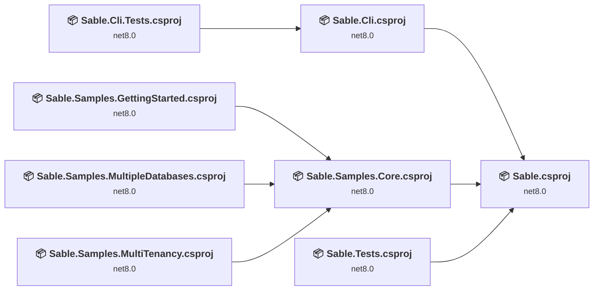
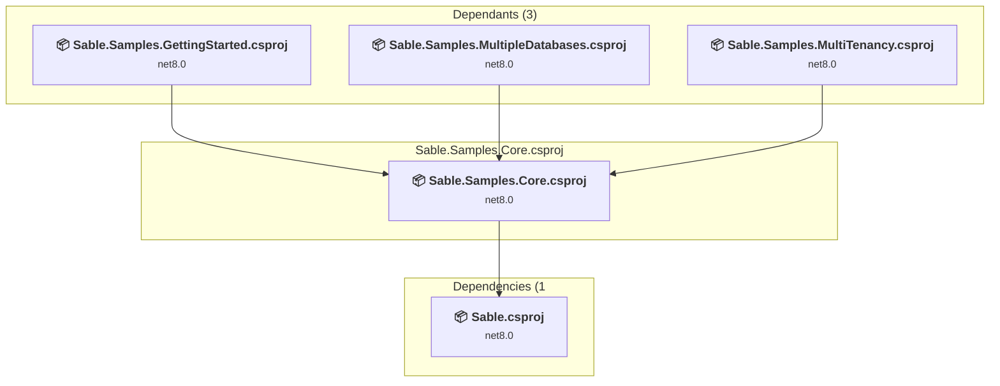
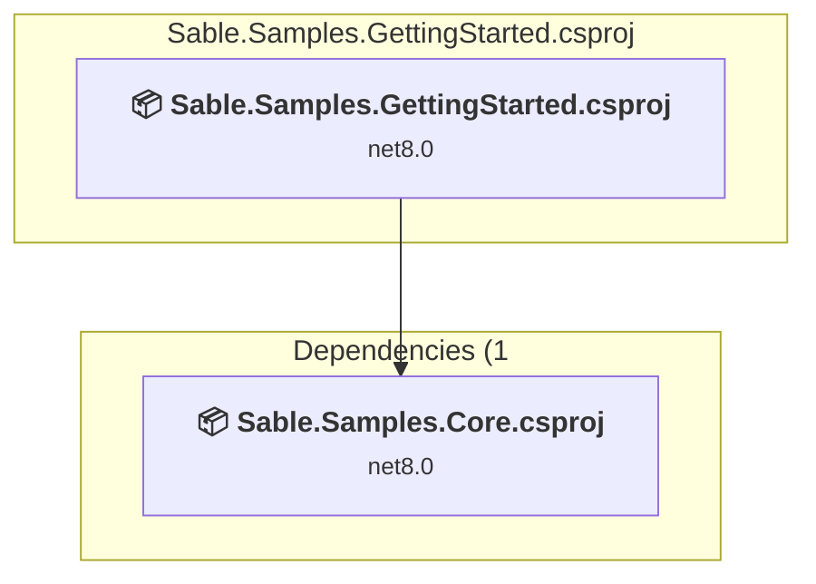
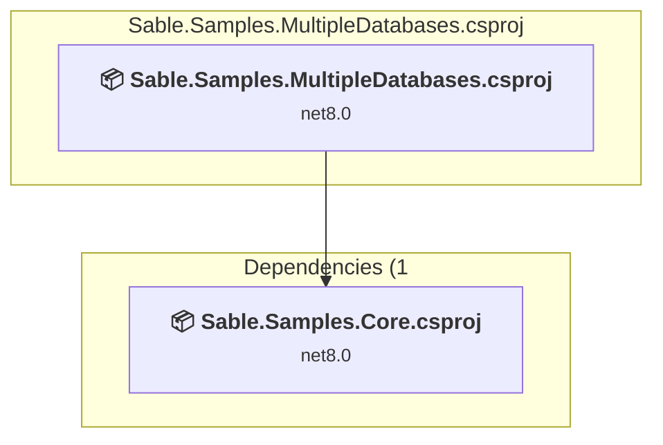
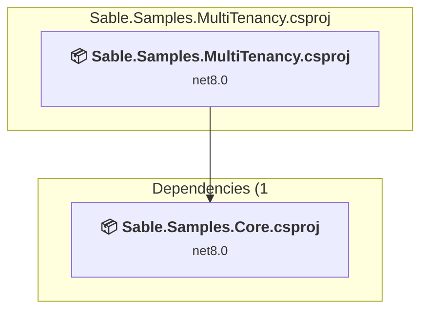
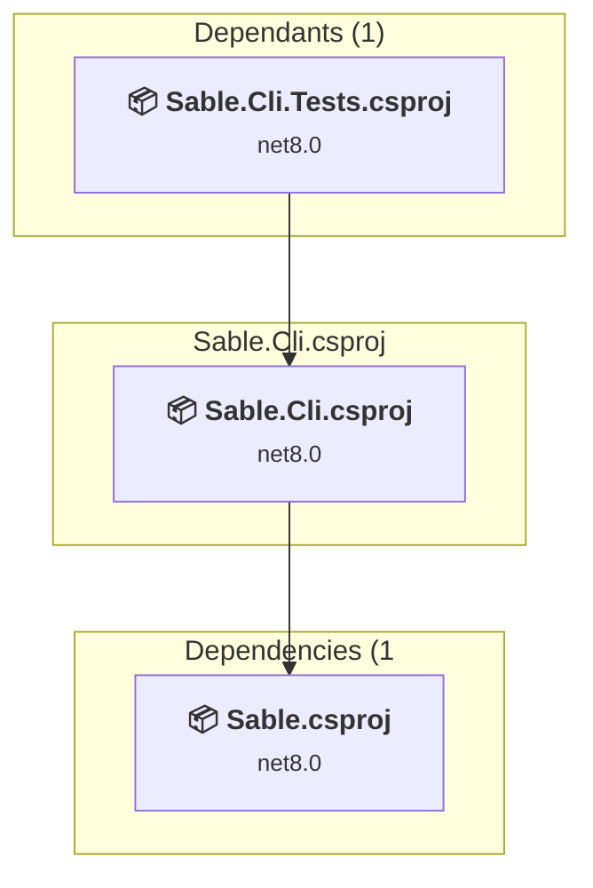
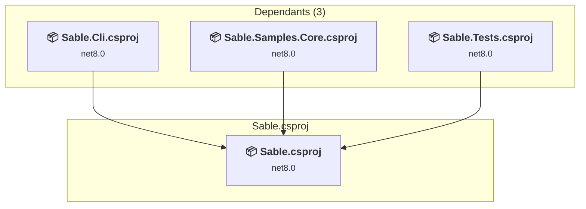
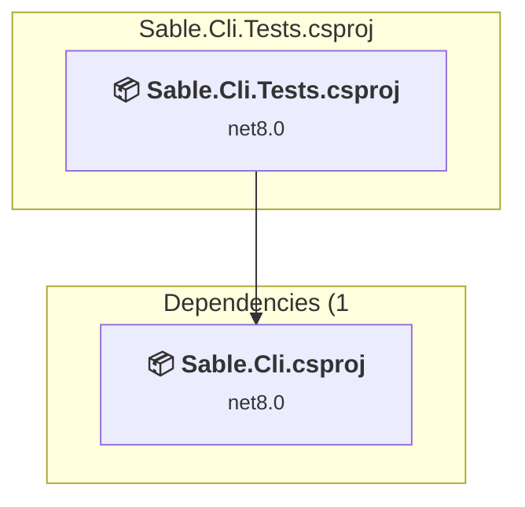
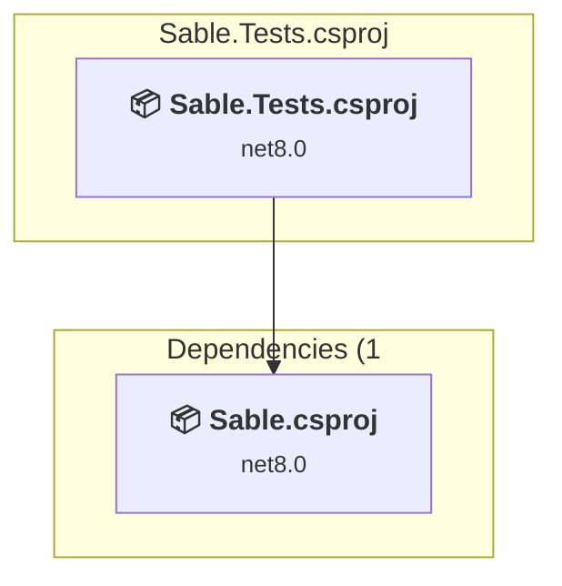

# Projects and dependencies analysis

This document provides a comprehensive overview of the projects and their dependencies in the context of upgrading to .NETCoreApp,Version=v10.0.

## Table of Contents

- [Executive Summary](#executive-Summary)
  - [Highlevel Metrics](#highlevel-metrics)
  - [Projects Compatibility](#projects-compatibility)
  - [Package Compatibility](#package-compatibility)
  - [API Compatibility](#api-compatibility)
- [Aggregate NuGet packages details](#aggregate-nuget-packages-details)
- [Top API Migration Challenges](#top-api-migration-challenges)
  - [Technologies and Features](#technologies-and-features)
  - [Most Frequent API Issues](#most-frequent-api-issues)
- [Projects Relationship Graph](#projects-relationship-graph)
- [Project Details](#project-details)

  - [samples\Sable.Samples.Core\Sable.Samples.Core.csproj](#samplessablesamplescoresablesamplescorecsproj)
  - [samples\Sable.Samples.GettingStarted\Sable.Samples.GettingStarted.csproj](#samplessablesamplesgettingstartedsablesamplesgettingstartedcsproj)
  - [samples\Sable.Samples.MultipleDatabases\Sable.Samples.MultipleDatabases.csproj](#samplessablesamplesmultipledatabasessablesamplesmultipledatabasescsproj)
  - [samples\Sable.Samples.MultiTenancy\Sable.Samples.MultiTenancy.csproj](#samplessablesamplesmultitenancysablesamplesmultitenancycsproj)
  - [src\Sable.Cli\Sable.Cli.csproj](#srcsableclisableclicsproj)
  - [src\Sable\Sable.csproj](#srcsablesablecsproj)
  - [tests\Sable.Cli.Tests\Sable.Cli.Tests.csproj](#testssableclitestssableclitestscsproj)
  - [tests\Sable.Tests\Sable.Tests.csproj](#testssabletestssabletestscsproj)

## Executive Summary

### Highlevel Metrics

| Metric | Count | Status |
| :--- | :---: | :--- |
| Total Projects | 8 | All require upgrade |
| Total NuGet Packages | 17 | 3 need upgrade |
| Total Code Files | 31 |  |
| Total Code Files with Incidents | 9 |  |
| Total Lines of Code | 1482 |  |
| Total Number of Issues | 15 |  |
| Estimated LOC to modify | 2+ | at least 0.1% of codebase |

### Projects Compatibility

| Project | Target Framework | Difficulty | Package Issues | API Issues | Est. LOC Impact | Description |
| :--- | :---: | :---: | :---: | :---: | :---: | :--- |
| [samples\Sable.Samples.Core\Sable.Samples.Core.csproj](#samplessablesamplescoresablesamplescorecsproj) | net8.0 | 🟢 Low | 1 | 0 |  | ClassLibrary, Sdk Style = True |
| [samples\Sable.Samples.GettingStarted\Sable.Samples.GettingStarted.csproj](#samplessablesamplesgettingstartedsablesamplesgettingstartedcsproj) | net8.0 | 🟢 Low | 0 | 0 |  | AspNetCore, Sdk Style = True |
| [samples\Sable.Samples.MultipleDatabases\Sable.Samples.MultipleDatabases.csproj](#samplessablesamplesmultipledatabasessablesamplesmultipledatabasescsproj) | net8.0 | 🟢 Low | 0 | 0 |  | AspNetCore, Sdk Style = True |
| [samples\Sable.Samples.MultiTenancy\Sable.Samples.MultiTenancy.csproj](#samplessablesamplesmultitenancysablesamplesmultitenancycsproj) | net8.0 | 🟢 Low | 0 | 0 |  | AspNetCore, Sdk Style = True |
| [src\Sable.Cli\Sable.Cli.csproj](#srcsableclisableclicsproj) | net8.0 | 🟢 Low | 3 | 2 | 2+ | DotNetCoreApp, Sdk Style = True |
| [src\Sable\Sable.csproj](#srcsablesablecsproj) | net8.0 | 🟢 Low | 1 | 0 |  | ClassLibrary, Sdk Style = True |
| [tests\Sable.Cli.Tests\Sable.Cli.Tests.csproj](#testssableclitestssableclitestscsproj) | net8.0 | 🟢 Low | 0 | 0 |  | DotNetCoreApp, Sdk Style = True |
| [tests\Sable.Tests\Sable.Tests.csproj](#testssabletestssabletestscsproj) | net8.0 | 🟢 Low | 0 | 0 |  | DotNetCoreApp, Sdk Style = True |

### Package Compatibility

| Status | Count | Percentage |
| :--- | :---: | :---: |
| ✅ Compatible | 14 | 82.4% |
| ⚠️ Incompatible | 0 | 0.0% |
| 🔄 Upgrade Recommended | 3 | 17.6% |
| ***Total NuGet Packages*** | ***17*** | ***100%*** |

### API Compatibility

| Category | Count | Impact |
| :--- | :---: | :--- |
| 🔴 Binary Incompatible | 0 | High - Require code changes |
| 🟡 Source Incompatible | 2 | Medium - Needs re-compilation and potential conflicting API error fixing |
| 🔵 Behavioral change | 0 | Low - Behavioral changes that may require testing at runtime |
| ✅ Compatible | 1509 |  |
| ***Total APIs Analyzed*** | ***1511*** |  |

## Aggregate NuGet packages details

| Package | Current Version | Suggested Version | Projects | Description |
| :--- | :---: | :---: | :--- | :--- |
| CliWrap | 3.6.4 |  | [Sable.Cli.csproj](#srcsableclisableclicsproj) | ✅Compatible |
| coverlet.collector | 3.1.2 |  | [Sable.Cli.Tests.csproj](#testssableclitestssableclitestscsproj) [Sable.Tests.csproj](#testssabletestssabletestscsproj) | ✅Compatible |
| Marten | 7.37.0 |  | [Sable.csproj](#srcsablesablecsproj) [Sable.Samples.Core.csproj](#samplessablesamplescoresablesamplescorecsproj) | ✅Compatible |
| Marten.CommandLine | 7.37.0 |  | [Sable.csproj](#srcsablesablecsproj) [Sable.Samples.Core.csproj](#samplessablesamplescoresablesamplescorecsproj) | ✅Compatible |
| Microsoft.Extensions.DependencyInjection | 7.0.0 | 10.0.1 | [Sable.Cli.csproj](#srcsableclisableclicsproj) | NuGet package upgrade is recommended |
| Microsoft.Extensions.Logging.Abstractions | 9.0.1 | 10.0.1 | [Sable.Cli.csproj](#srcsableclisableclicsproj) [Sable.csproj](#srcsablesablecsproj) [Sable.Samples.Core.csproj](#samplessablesamplescoresablesamplescorecsproj) | NuGet package upgrade is recommended |
| Microsoft.NET.Test.Sdk | 17.3.0 |  | [Sable.Cli.Tests.csproj](#testssableclitestssableclitestscsproj) [Sable.Tests.csproj](#testssabletestssabletestscsproj) | ✅Compatible |
| Microsoft.SourceLink.GitHub | 1.1.1 |  | [Sable.Cli.csproj](#srcsableclisableclicsproj) [Sable.csproj](#srcsablesablecsproj) | ✅Compatible |
| MinVer | 4.2.0 |  | [Sable.Cli.csproj](#srcsableclisableclicsproj) [Sable.csproj](#srcsablesablecsproj) | ✅Compatible |
| Newtonsoft.Json | 13.0.3 | 13.0.4 | [Sable.Cli.csproj](#srcsableclisableclicsproj) | NuGet package upgrade is recommended |
| Npgsql | 8.0.6 |  | [Sable.Cli.csproj](#srcsableclisableclicsproj) | ✅Compatible |
| Scriban | 5.7.0 |  | [Sable.Cli.csproj](#srcsableclisableclicsproj) | ✅Compatible |
| Spectre.Console | 0.47.0 |  | [Sable.Cli.csproj](#srcsableclisableclicsproj) | ✅Compatible |
| Spectre.Console.Cli | 0.47.0 |  | [Sable.Cli.csproj](#srcsableclisableclicsproj) | ✅Compatible |
| Testcontainers | 3.3.0 |  | [Sable.Cli.csproj](#srcsableclisableclicsproj) | ✅Compatible |
| xunit | 2.4.2 |  | [Sable.Cli.Tests.csproj](#testssableclitestssableclitestscsproj) [Sable.Tests.csproj](#testssabletestssabletestscsproj) | ✅Compatible |
| xunit.runner.visualstudio | 2.4.5 |  | [Sable.Cli.Tests.csproj](#testssableclitestssableclitestscsproj) [Sable.Tests.csproj](#testssabletestssabletestscsproj) | ✅Compatible |

## Top API Migration Challenges

### Technologies and Features

| Technology | Issues | Percentage | Migration Path |
| :--- | :---: | :---: | :--- |

### Most Frequent API Issues

| API | Count | Percentage | Category |
| :--- | :---: | :---: | :--- |
| M:System.TimeSpan.FromSeconds(System.Double) | 2 | 100.0% | Source Incompatible |

## Projects Relationship Graph

Legend:
📦 SDK-style project
⚙️ Classic project

## Project Details

### samples\Sable.Samples.Core\Sable.Samples.Core.csproj

#### Project Info

- **Current Target Framework:** net8.0
- **Proposed Target Framework:** net10.0
- **SDK-style**: True
- **Project Kind:** ClassLibrary
- **Dependencies**: 1
- **Dependants**: 3
- **Number of Files**: 3
- **Number of Files with Incidents**: 1
- **Lines of Code**: 32
- **Estimated LOC to modify**: 0+ (at least 0.0% of the project)

#### Dependency Graph

Legend:
📦 SDK-style project
⚙️ Classic project

### API Compatibility

| Category | Count | Impact |
| :--- | :---: | :--- |
| 🔴 Binary Incompatible | 0 | High - Require code changes |
| 🟡 Source Incompatible | 0 | Medium - Needs re-compilation and potential conflicting API error fixing |
| 🔵 Behavioral change | 0 | Low - Behavioral changes that may require testing at runtime |
| ✅ Compatible | 25 |  |
| ***Total APIs Analyzed*** | ***25*** |  |

### samples\Sable.Samples.GettingStarted\Sable.Samples.GettingStarted.csproj

#### Project Info

- **Current Target Framework:** net8.0
- **Proposed Target Framework:** net10.0
- **SDK-style**: True
- **Project Kind:** AspNetCore
- **Dependencies**: 1
- **Dependants**: 0
- **Number of Files**: 3
- **Number of Files with Incidents**: 1
- **Lines of Code**: 30
- **Estimated LOC to modify**: 0+ (at least 0.0% of the project)

#### Dependency Graph

Legend:
📦 SDK-style project
⚙️ Classic project

### API Compatibility

| Category | Count | Impact |
| :--- | :---: | :--- |
| 🔴 Binary Incompatible | 0 | High - Require code changes |
| 🟡 Source Incompatible | 0 | Medium - Needs re-compilation and potential conflicting API error fixing |
| 🔵 Behavioral change | 0 | Low - Behavioral changes that may require testing at runtime |
| ✅ Compatible | 49 |  |
| ***Total APIs Analyzed*** | ***49*** |  |

### samples\Sable.Samples.MultipleDatabases\Sable.Samples.MultipleDatabases.csproj

#### Project Info

- **Current Target Framework:** net8.0
- **Proposed Target Framework:** net10.0
- **SDK-style**: True
- **Project Kind:** AspNetCore
- **Dependencies**: 1
- **Dependants**: 0
- **Number of Files**: 3
- **Number of Files with Incidents**: 1
- **Lines of Code**: 52
- **Estimated LOC to modify**: 0+ (at least 0.0% of the project)

#### Dependency Graph

Legend:
📦 SDK-style project
⚙️ Classic project

### API Compatibility

| Category | Count | Impact |
| :--- | :---: | :--- |
| 🔴 Binary Incompatible | 0 | High - Require code changes |
| 🟡 Source Incompatible | 0 | Medium - Needs re-compilation and potential conflicting API error fixing |
| 🔵 Behavioral change | 0 | Low - Behavioral changes that may require testing at runtime |
| ✅ Compatible | 97 |  |
| ***Total APIs Analyzed*** | ***97*** |  |

### samples\Sable.Samples.MultiTenancy\Sable.Samples.MultiTenancy.csproj

#### Project Info

- **Current Target Framework:** net8.0
- **Proposed Target Framework:** net10.0
- **SDK-style**: True
- **Project Kind:** AspNetCore
- **Dependencies**: 1
- **Dependants**: 0
- **Number of Files**: 3
- **Number of Files with Incidents**: 1
- **Lines of Code**: 34
- **Estimated LOC to modify**: 0+ (at least 0.0% of the project)

#### Dependency Graph

Legend:
📦 SDK-style project
⚙️ Classic project

### API Compatibility

| Category | Count | Impact |
| :--- | :---: | :--- |
| 🔴 Binary Incompatible | 0 | High - Require code changes |
| 🟡 Source Incompatible | 0 | Medium - Needs re-compilation and potential conflicting API error fixing |
| 🔵 Behavioral change | 0 | Low - Behavioral changes that may require testing at runtime |
| ✅ Compatible | 57 |  |
| ***Total APIs Analyzed*** | ***57*** |  |

### src\Sable.Cli\Sable.Cli.csproj

#### Project Info

- **Current Target Framework:** net8.0
- **Proposed Target Framework:** net10.0
- **SDK-style**: True
- **Project Kind:** DotNetCoreApp
- **Dependencies**: 1
- **Dependants**: 1
- **Number of Files**: 20
- **Number of Files with Incidents**: 2
- **Lines of Code**: 1097
- **Estimated LOC to modify**: 2+ (at least 0.2% of the project)

#### Dependency Graph

Legend:
📦 SDK-style project
⚙️ Classic project

### API Compatibility

| Category | Count | Impact |
| :--- | :---: | :--- |
| 🔴 Binary Incompatible | 0 | High - Require code changes |
| 🟡 Source Incompatible | 2 | Medium - Needs re-compilation and potential conflicting API error fixing |
| 🔵 Behavioral change | 0 | Low - Behavioral changes that may require testing at runtime |
| ✅ Compatible | 956 |  |
| ***Total APIs Analyzed*** | ***958*** |  |

### src\Sable\Sable.csproj

#### Project Info

- **Current Target Framework:** net8.0
- **Proposed Target Framework:** net10.0
- **SDK-style**: True
- **Project Kind:** ClassLibrary
- **Dependencies**: 0
- **Dependants**: 3
- **Number of Files**: 2
- **Number of Files with Incidents**: 1
- **Lines of Code**: 104
- **Estimated LOC to modify**: 0+ (at least 0.0% of the project)

#### Dependency Graph

Legend:
📦 SDK-style project
⚙️ Classic project

### API Compatibility

| Category | Count | Impact |
| :--- | :---: | :--- |
| 🔴 Binary Incompatible | 0 | High - Require code changes |
| 🟡 Source Incompatible | 0 | Medium - Needs re-compilation and potential conflicting API error fixing |
| 🔵 Behavioral change | 0 | Low - Behavioral changes that may require testing at runtime |
| ✅ Compatible | 109 |  |
| ***Total APIs Analyzed*** | ***109*** |  |

### tests\Sable.Cli.Tests\Sable.Cli.Tests.csproj

#### Project Info

- **Current Target Framework:** net8.0
- **Proposed Target Framework:** net10.0
- **SDK-style**: True
- **Project Kind:** DotNetCoreApp
- **Dependencies**: 1
- **Dependants**: 0
- **Number of Files**: 3
- **Number of Files with Incidents**: 1
- **Lines of Code**: 34
- **Estimated LOC to modify**: 0+ (at least 0.0% of the project)

#### Dependency Graph

Legend:
📦 SDK-style project
⚙️ Classic project

### API Compatibility

| Category | Count | Impact |
| :--- | :---: | :--- |
| 🔴 Binary Incompatible | 0 | High - Require code changes |
| 🟡 Source Incompatible | 0 | Medium - Needs re-compilation and potential conflicting API error fixing |
| 🔵 Behavioral change | 0 | Low - Behavioral changes that may require testing at runtime |
| ✅ Compatible | 36 |  |
| ***Total APIs Analyzed*** | ***36*** |  |

### tests\Sable.Tests\Sable.Tests.csproj

#### Project Info

- **Current Target Framework:** net8.0
- **Proposed Target Framework:** net10.0
- **SDK-style**: True
- **Project Kind:** DotNetCoreApp
- **Dependencies**: 1
- **Dependants**: 0
- **Number of Files**: 4
- **Number of Files with Incidents**: 1
- **Lines of Code**: 99
- **Estimated LOC to modify**: 0+ (at least 0.0% of the project)

#### Dependency Graph

Legend:
📦 SDK-style project
⚙️ Classic project

### API Compatibility

| Category | Count | Impact |
| :--- | :---: | :--- |
| 🔴 Binary Incompatible | 0 | High - Require code changes |
| 🟡 Source Incompatible | 0 | Medium - Needs re-compilation and potential conflicting API error fixing |
| 🔵 Behavioral change | 0 | Low - Behavioral changes that may require testing at runtime |
| ✅ Compatible | 180 |  |
| ***Total APIs Analyzed*** | ***180*** |  |

